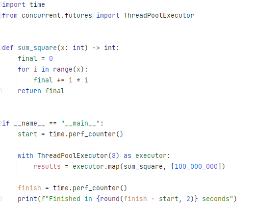
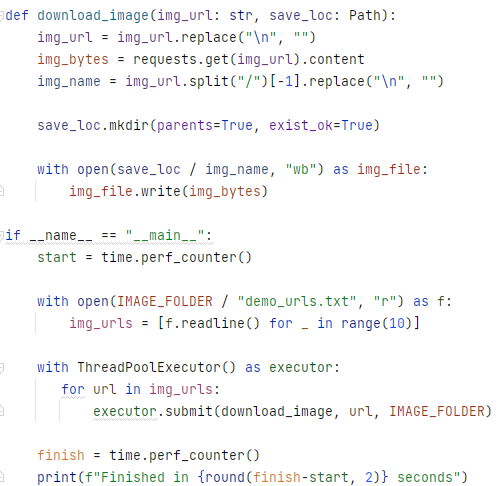

# Multiprocessing vs. Threading in Python

##### Process
A process is an instance of a computer program being executed. Each process has its own memory space it uses to store the instructions being run, as well as any data it needs to store and access to execute.

##### Threads
Threads are components of a process, which can run parallel-ly. There can be multiple threads in a process, and they share the same memory space, i.e. the memory space of the parent process. 
This means **all the variables declared in the program would be shared by all threads.**


```
You should use threading if your program is network-bound or multiprocessing if it is CPU-bound.
```

### Pitfalls of Parallel Computing
Introducing parallelism to a program is not always a positive-sum game; there are some pitfalls to be aware of. The most important ones are as follows.

* **Race Condition**: Threads have a shared memory space, and therefore they can have access to shared variables. **A race condition occurs when multiple threads try to change the same variable simultaneously. The thread scheduler can arbitrarily swap between threads, so we have no way of knowing the order in which the threads will try to change the data.** This can result in incorrect behavior in either of the threads, particularly if the threads decide to do something based on the value of the variable. To prevent this from happening, a mutual exclusion (or mutex) lock can be placed around the piece of the code that modifies the variable so that only one thread can write to the variable at a time.
* **Starvation**: Starvation occurs when a thread is denied access to a particular resource for longer periods of time, and as a result, the overall program slows down. This can happen as an unintended side effect of a poorly designed thread-scheduling algorithm.
* **Deadlock**: A deadlock is a state when a thread is waiting for another thread to release a lock, but that other thread needs a resource to finish that the first thread is holding onto. This way, both of the threads come to a standstill and the program halts. **Deadlock can be thought of as an extreme case of starvation**. To avoid this, we have to be careful not to introduce too many locks that are interdependent.
* **Livelock** : Livelock is when threads keep running in a loop but don’t make any progress. This also arises out of poor design and improper use of mutex locks.


### Multiprocessing and Threading in Python

##### The Global Interpreter Lock
When it comes to Python, there are some oddities to keep in mind.  
Since threads share the same memory space, **the CPython interpreter takes precautions so that two threads don’t write to the same memory location, using a mechanism called Global Interpreter Lock (GIL)**

From the Python wiki:
```
In CPython, the global interpreter lock, or GIL, is a mutex that protects access to Python objects, preventing multiple threads from executing Python bytecodes at once. 
This lock is necessary mainly because CPython’s memory management is not thread-safe.
```

Check the slides [here](https://www.dabeaz.com/python/UnderstandingGIL.pdf) for a more detailed look at the Python GIL.

GIL effectively serializes the instructions at the interpreter level. 

How this works is as follows: 
- for any thread to perform any function, it must acquire a global lock. 
- Only a single thread can acquire that lock at a time, which means the interpreter ultimately runs the instructions serially. 
- This design makes memory management thread-safe, but as a consequence, it can’t utilize multiple CPU cores at all. - In single-core CPUs, **which is what the designers had in mind while developing CPython**, it’s not much of a problem. But this global lock ends up being a bottleneck if you’re using multi-core CPUs.


Consider the two programs below

| CPU bound | I/O Bound |
|---|---|
| | |
| Even though we specified 8 threads to be used, it did nothing to speed up this process, because the thread-1 when starts running, acquires the GIL and threads-2 to 8, need to wait for GIL to be released| Using multithreading completed the entire process in 1.5 seconds instead of 6 seconds when using a single thread. Notice that all CPU Cores were utilised.|

### Remember, Python Threads Only Solve I/O-Bound Problems


### Multiprocessing

If we were to run the same process above using ProcessPoolExecutor (i.e. multiprocess), the speed is slightly slower than 1.5 seconds but significantly less than 6 seconds
```
from concurrent.futures import ProcessPoolExecutor

...

    with ProcessPoolExecutor() as executor:
       for url in img_urls:
           executor.submit(download_image, url, IMAGE_FOLDER)

...
```

Since the download_image function consists of largely I/O operations, we benefited largely from the time savings while waiting for these operations to complete.

So, multiprocessing allowed us to download the 80 images fairly quickly in ~3 seconds, albeit being more RAM intensive. 
This is because **Python multiprocessing uses pickle to serialise objects when passing them between processes**, requiring each process to create its own copy of the data, adding substantial memory usage, not to mention expensive deserialisation.


### Key Takeaways
* Python is NOT a single-threaded language.
* Python processes typically use a single thread because of the GIL.
* Despite the GIL, libraries that perform computationally heavy tasks like numpy, scipy and pytorch utilise C-based implementations under the hood, allowing the use of multiple cores.
* As a rule of thumb, processes that are largely I/O bound benefit from multithreading while computationally heavy tasks benefit from multiprocessing.

### Bypassing the GIL

* One obvious solution, as seen above, is to use **Process-based parallelism** using **concurrent.futures**
* There have been several attempts, like **free-threading, pypy-stm, PyParallel, nogil and PEP-703** to remove GIL over the years with various levels of success,
* Use an alternative to CPython, like **nogil, Jython and IronPython**, both targetting python 2.7
* Use a GIL-Immune library like **Numpy**, which relies on **highly optimized BLAS and LAPACK libraries**, which can take advantage of your CPU’s vector features and multiple cores for efficient linear algebra operations.
* consider building a **Python C extension module to externalize the most critical bits of code to C**, where the GIL won’t be a burden.
* Use a python based programming language like **Cython**(as a hybrid of C and Python), which combines the high-level syntax of a familiar programming language with the speed of compiled C code. 
* Use **Foreign Function Interface (FFI)** by using interpreter shipped **ctypes**, which lets you make calls to C functions from Python.

### What is CPython?
CPython is the **reference implementation** of the Python programming language, written in **C**. It is the most widely used and official implementation of Python, maintained by the Python Software Foundation.

#### Key Features of CPython:
- **Interpreted and Compiled**: CPython first compiles Python code into bytecode (.pyc files) and then interprets it using a virtual machine.
- **Automatic Memory Management**: Uses garbage collection and reference counting to manage memory.
- **C Extensions**: Allows integration with C and C++ libraries, making it powerful for performance-heavy applications.
- **Multi-threading with GIL**: Uses a Global Interpreter Lock (GIL), meaning only one thread executes Python bytecode at a time.
- **Standard Implementation**: CPython follows the official Python language specification.


### Alternatives to CPython:
- **PyPy** – A JIT-compiled (Just-In-Time) implementation that is often faster than CPython.
- **Jython** – Runs Python on the Java Virtual Machine (JVM).
- **IronPython** – Python implementation for .NET and Mono.
- **MicroPython** – Lightweight Python implementation for microcontrollers.

### Remember Java is also compiled and interpreted, however...

| Feature | CPython (Python) | Java |
|---|---|---|
| Compilation |	Compiles to bytecode (.pyc files) | Compiles to bytecode (.class files) |
| Portability |Runs on any system with CPython | Runs on any system with a JVM |
| Execution | The CPython interpreter executes the bytecode | The Java Virtual Machine (JVM) executes the bytecode |
| Interpretation |	CPython directly interprets the bytecode |	JVM interprets or JIT compiles the bytecode into machine code |
| Performance |	**Slower due to direct interpretation** | **Faster due to JIT compilation** |

Hence, **PyPy, as a JIT compiler,** can achieve speeds comparable to Java in many cases, though it, like Java, may experience slower JIT warm-up times. However, PyPy still retains Python's Global Interpreter Lock (GIL) (except in specialized cases like PyPy STM), giving **Java a clear advantage in heavy multi-threading scenarios.**


# Difference between Concurrency and Parallelism

| Concurrency | Parallelism |
| ---|---|
| Concurrency is the task of running and managing the multiple computations at the same time| While parallelism is the task of running multiple computations simultaneously|
| Concurrency is achieved through the interleaving operation of processes on the central processing unit(CPU) or in other words by the context switching||	Parallelism is achieved by through multiple central processing units(CPUs).|
| Concurrency can be done by using a single processing unit|	Parallelism  can’t be done by using a single processing unit. it needs multiple processing units.|
| Concurrency increases the amount of work finished at a time |	Parallelism improves the throughput and computational speed of the system |
| Concurrency **deals with** lot of things simultaneously |	Parallelism **does a lot of things** simultaneously |
| Concurrency is the non-deterministic control flow approach|	Parallelism is deterministic control flow approach.|


# Sharing Data between python processes

multiprocessing supports two types of communication channel between processes:

### Queues

The Queue class is a near clone of Queue.Queue. For example:

```
from multiprocessing import Process, Queue

def f(q):
    q.put([42, None, 'hello'])

if __name__ == '__main__':
    q = Queue()
    p = Process(target=f, args=(q,))
    p.start()
    print q.get()    # prints "[42, None, 'hello']"
    p.join()
```
Queues are thread and process safe.

### Pipes

The Pipe() function returns a pair of connection objects connected by a pipe which by default is duplex (two-way). For example:

```text
from multiprocessing import Process, Pipe

def f(conn):
    conn.send([42, None, 'hello'])
    conn.close()

if __name__ == '__main__':
    parent_conn, child_conn = Pipe()
    p = Process(target=f, args=(child_conn,))
    p.start()
    print parent_conn.recv()   # prints "[42, None, 'hello']"
    p.join()
```
The two connection objects returned by Pipe() represent the two ends of the pipe. Each connection object has `send()` and `recv()` methods (among others). Note that data in a pipe may become corrupted if two processes (or threads) try to read from or write to the same end of the pipe at the same time. Of course there is no risk of corruption from processes using different ends of the pipe at the same time.

# Synchronization between processes

multiprocessing contains equivalents of all the synchronization primitives from threading. For instance one can use a `lock` to ensure that only one process prints to standard output at a time:

```text
from multiprocessing import Process, Lock

def f(l, i):
    l.acquire()
    print 'hello world', i
    l.release()

if __name__ == '__main__':
    lock = Lock()

    for num in range(10):
        Process(target=f, args=(lock, num)).start()
 ```
Without using the lock output from the different processes is liable to get all mixed up.

